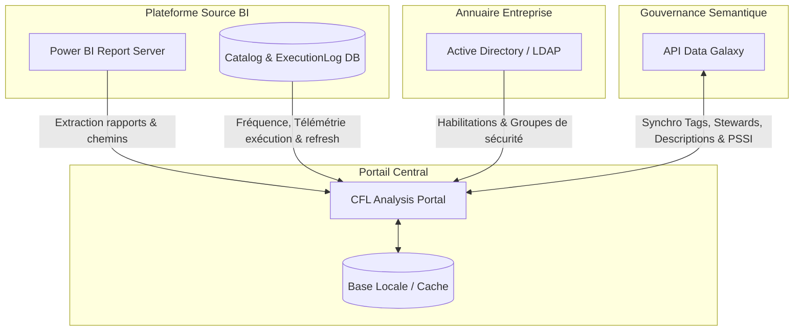

# CAHIER DES CHARGES
## Projet : Portail de Gouvernance BI — CFL Analysis
### Intégration des Données PBIRS (Power BI Report Server) et Data Galaxy

---

## 1. Contexte et Enjeux

Au sein des CFL (Chemins de Fer Luxembourgeois), la production décisionnelle s'appuie historiquement sur la plateforme **Power BI Report Server (PBIRS)**. Bien que cette plateforme héberge des rapports essentiels pour l'ensemble des départements (Qualité, Finances, RH, Voyageurs, etc.), elle souffre d'un manque de centralisation de la gouvernance, d'une absence de dictionnaire de données partagé et d'une visibilité limitée sur le cycle de vie des rapports (obsolescence, certification).

En parallèle, **Data Galaxy** a été choisi comme l'outil de gouvernance des données de l'entreprise (Data Catalog et Glossaire Métier). Cependant, sans liaison directe avec l'environnement physique PBIRS, Data Galaxy ne permet pas de refléter en temps réel l'utilisation réelle des rapports, les derniers rafraîchissements ou les habilitations d'accès réelles.

### Le Portail « CFL Analysis »
Le portail **CFL Analysis** agit comme le pont applicatif entre l'environnement technique (PBIRS) et l'environnement sémantique de gouvernance (Data Galaxy). L'objectif est d'unifier ces données pour offrir une expérience utilisateur claire, sécurisée et pilotée par la qualité.

---

## 2. Objectifs du Projet

L'intégration a pour buts principaux :
1. **Centraliser la gouvernance** : Proposer un point d'accès unique regroupant les métadonnées techniques de PBIRS et les métadonnées sémantiques de Data Galaxy.
2. **Améliorer la découvrabilité** : Faciliter la recherche de rapports par des mots-clés sémantiques (tags) synchronisés, sans forcer l'utilisateur à connaître l'arborescence physique des serveurs BI.
3. **Automatiser le cycle de vie** : Identifier et archiver automatiquement les rapports obsolètes ou mal nommés selon des critères de qualité définis.
4. **Piloter la conformité et la sécurité** : Suivre l'affectation des *Data Stewards*, les niveaux de classification de sécurité (PSSI) et mapper les accès Active Directory (AD) associés aux rapports.

---

## 3. Cartographie des Données (Mapping PBIRS / Data Galaxy)

Le tableau suivant spécifie la provenance et la nature de chaque donnée clé exploitée dans le portail CFL Analysis :

| Champ dans le Portail | Description Fonctionnelle | Source Primaire | Mode d'Intégration |
| :--- | :--- | :--- | :--- |
| **ID Rapport (`id`)** | Identifiant unique de la fiche rapport. | PBIRS (Catalog DB) | Import quotidien |
| **Titre (`title`)** | Nom d'usage ou nom technique du rapport. | PBIRS | Import quotidien |
| **Description (`desc`)** | Définition sémantique et explicative du rapport. | Data Galaxy | Synchro API (lecture/écriture) |
| **Service Métier (`service`)** | Direction ou service propriétaire du rapport (ex: Qualité, RH). | Data Galaxy / RH | Synchro API |
| **Classification (`classification`)**| Niveau de certification du rapport (ex: Certifié DWH, Self-Service, Public). | Data Galaxy | Synchro API |
| **Niveau PSSI (`pssi`)** | Niveau de sensibilité de la donnée (Public, Interne, Restreint, Confidentiel). | Data Galaxy | Synchro API |
| **Mots-clés (`tags`)** | Tags sémantiques associés à la taxonomie métier. | Data Galaxy | Synchro API (bidirectionnel) |
| **Propriétaire (`owner`)** | Data Steward ou interlocuteur métier de référence. | Data Galaxy | Synchro API / Annuaire interne |
| **Fréquence (`frequency`)** | Rythme de mise à jour du rapport (Quotidien, Hebdo, Mensuel). | PBIRS | Extraction technique |
| **Dernier Refresh (`lastRefresh`)** | Date et heure de la dernière exécution réussie du rapport. | PBIRS | Requête DB Catalog |
| **Chemin Physique (`pbirsPath`)** | Emplacement technique dans l'arborescence du serveur. | PBIRS | Extraction technique |
| **Consultations (`viewcount`)** | Nombre cumulé de consultations (télémétrie d'usage). | PBIRS (ExecutionLog) | Requête SQL Server |
| **Groupes AD (`adGroups`)** | Groupes Active Directory autorisés à lire le rapport. | Active Directory / PBIRS | Synchro LDAP / API PBIRS |
| **URL Rapport (`pbirsUrl`)** | Lien hypertexte direct pour visualiser le rapport. | PBIRS | Généré dynamiquement |

---

## 4. Architecture Fonctionnelle de l'Intégration

Le schéma ci-dessous montre comment le portail CFL Analysis orchestre les échanges entre les différentes briques technologiques :



---

## 5. Spécifications Fonctionnelles

### 5.1. Dashboard de Pilotage & Indicateurs (KPIs)
Le portail doit proposer une page d'accueil (Tableau de bord) agrégeant les statistiques de gouvernance issues des deux plateformes :
* **Taux de complétion des Data Stewards** : Pourcentage de rapports associés à un steward identifié (donnée Data Galaxy).
* **Répartition par Classification** : Graphique montrant la part de rapports "Certifiés DWH" vs "Self-Service".
* **Conformité PSSI** : Vue globale des niveaux de confidentialité (Interne, Confidentiel, Restreint).
* **Volumétrie et Activité** : Total des rapports actifs et top 5 des rapports les plus consultés (donnée télémétrie PBIRS).
* **Statut de Synchronisation** : Indicateur visuel en temps réel de la liaison avec l'API Data Galaxy (Vert = Connecté, Rouge = Erreur de liaison).

### 5.2. Catalogue de Recherche Sémantique
* **Recherche Textuelle** : Recherche floue (fuzzy search) sur le titre, la description, les tags ou le steward.
* **Filtres Avancés** :
  * Filtrage par Service Émetteur (Qualité, Informatique, Voyageurs, etc.).
  * Filtrage par Certification (DWH, Self-service, Public).
  * Filtrage par Niveau PSSI.
  * Filtrage rapide par Tags Data Galaxy.
* **Fiches d'identité des rapports (Drawer/Panneau) :** 
  En cliquant sur un rapport, un panneau latéral doit s'ouvrir pour afficher l'ensemble des données unifiées :
  * Informations Métiers (Data Galaxy) : Description, Stewardship, Classification, Tags.
  * Informations Techniques (PBIRS) : Chemin, Url d'intégration, Date de rafraîchissement, Volume de consultations.

### 5.3. Module de Gouvernance de la Qualité et d'Obsolescence
Le portail applique un ensemble de règles automatisées combinant données PBIRS et Data Galaxy pour détecter les anomalies de qualité :
1. **Règle d'inactivité (Obsolescence)** : Tout rapport n'ayant pas été rafraîchi sur PBIRS depuis plus de 24 mois est marqué comme inactif.
2. **Règle de nommage (Versioning)** : Détection de mots-clés techniques interdits dans le titre du rapport (`test`, `old`, `backup`, `bk`).
3. **Règle d'année dépassée** : Détection d'années antérieures à l'année en cours (`2024`, `2025` pour une évaluation en 2026) dans le titre du rapport.
4. **Règle d'emplacement temporaire** : Présence du rapport dans un répertoire technique obsolète (ex : `/OLD`, `/Archive`, `/Backup` sur PBIRS).

**Action curative (Archivage automatique)** :
* L'administrateur peut déclencher un archivage. 
* Cette action modifie physiquement le chemin du rapport sur PBIRS pour le déplacer vers un dossier technique `/Archive/` ou `/_Archives/` et envoie une mise à jour sémantique vers Data Galaxy pour marquer le rapport comme archivé.

### 5.4. Campagne de Récertification Périodique
Pour maintenir la fraîcheur du dictionnaire Data Galaxy, le portail gère une campagne de récertification :
* **Déclenchement** : Périodique (ex: tous les 6 ou 12 mois).
* **Flux Data Steward** : Chaque steward reçoit la liste des rapports sous sa responsabilité.
* **Actions autorisées** :
  * **Conserver** : Confirme l'utilité du rapport et prolonge sa validité.
  * **Archiver** : Planifie le déplacement du rapport vers le dossier d'archives PBIRS.
  * **Transférer** : Modifie le Data Steward dans Data Galaxy.

### 5.5. Matrice de Sécurité et Gestion des Habilitations (AD)
* **Visualisation** : Le portail doit afficher l'association entre les dossiers PBIRS (ex: `/QUALITE/Clearing`) et les groupes Active Directory (ex: `DW_POWERBI_QUALITE_CLEARINGEF`).
* **Attribution des droits** : Les administrateurs peuvent ajouter/révoquer un groupe AD sur un rapport spécifique via le portail, ce qui déclenche en tâche de fond les requêtes d'habilitation sur le serveur PBIRS.

---

## 6. Spécifications Techniques et Flux d'Échange

### 6.1. Flux 1 : Extraction PBIRS (Fréquence : Quotidienne)
Ce flux extrait les métadonnées techniques depuis la base de données SQL Server hébergeant le serveur PBIRS (`ReportServer`).
* **Requête type sur la table `Catalog`** :
  ```sql
  SELECT 
      ItemID AS id,
      Name AS title,
      Path AS pbirsPath,
      CreationDate,
      ModifiedDate AS lastRefresh
  FROM Catalog
  WHERE Type = 2 -- 2 correspond aux rapports Power BI (.pbix) et paginés (.rdl)
  ```
* **Requête sur la table `ExecutionLog3`** (pour le `viewcount`) :
  ```sql
  SELECT 
      ItemPath AS pbirsPath,
      Count(*) AS viewcount
  FROM ExecutionLog3
  GROUP BY ItemPath
  ```

### 6.2. Flux 2 : Synchronisation Sémantique Data Galaxy (Fréquence : Temps Réel / Bouton Forcer)
Ce flux utilise les APIs REST de Data Galaxy pour synchroniser les métadonnées sémantiques.
* **API Lecture (Get Attributes)** :
  * `GET /api/v4/workspaces/{workspaceId}/properties` : Récupération des descriptions, des classifications et du niveau PSSI.
  * `GET /api/v4/workspaces/{workspaceId}/tags` : Récupération des tags associés.
* **API Écriture (Update Metadata)** :
  * `POST /api/v4/workspaces/{workspaceId}/attributes` : Mise à jour de la fiche du rapport dans le dictionnaire Data Galaxy lorsqu'un steward modifie le dictionnaire depuis le portail CFL Analysis.

> [!IMPORTANT]
> **Gestion de la résilience** : En cas de perte de connexion avec l'API Data Galaxy, le portail doit utiliser la dernière configuration stockée en cache local (LocalStorage ou DB locale) et inscrire une alerte en statut d'erreur dans la console d'administration.

### 6.3. Flux 3 : Intégration Active Directory (AD) (Fréquence : Temps Réel)
* **Protocole** : LDAP / LDAPS.
* **Fonctionnement** : Lecture des membres des groupes AD extraits du champ `adGroups` des rapports. Possibilité d'appeler des APIs d'Identity Management internes pour demander l'ajout de comptes dans les groupes AD appropriés.

---

## 7. Aspects de Sécurité et Non-Fonctionnels

### 7.1. Gestion des Rôles applicatifs (RBAC)
L'accès aux fonctionnalités du portail CFL Analysis est segmenté en 4 profils d'utilisateurs :
1. **Public/Lecteur** : Recherche dans le catalogue, consultation des fiches d'identité, accès aux liens PBIRS.
2. **Data Steward** : Droits du Lecteur + Édition des descriptions, des tags et participation aux campagnes de récertification pour son périmètre métier.
3. **Administrateur Technique** : Droits d'écriture complets, accès à la console de télémétrie, lancement des synchronisations forcées et archivage de rapports obsolètes.
4. **RSSI / Auditeur Sécurité** : Droits de lecture globaux et accès à la matrice de conformité PSSI.

### 7.2. Performance & Volumétrie
* **Capacité** : Le système doit pouvoir charger et indexer plus de 1 000 rapports sans ralentissement de l'interface utilisateur.
* **Temps de réponse** : Le filtrage du catalogue sémantique en mémoire doit prendre moins de 100 ms.
* **Caching** : Les appels API volumineux vers Data Galaxy doivent être mis en cache avec une durée de validité (TTL) de 2 heures par défaut.

---

> [!NOTE]
> Ce cahier des charges sert de document de référence pour l'équipe de développement en charge de l'évolution du portail CFL Analysis et les administrateurs de la gouvernance des données CFL.
